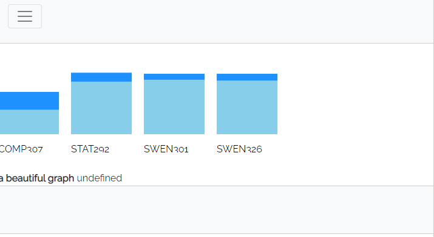

***
# Week 2 - Friday (5 01 2021)

## General progress
+ Added Graph for dummy data

## New Features

## New Bugs

## Tooling update
+ 

## Lessons Learnt
+ D3 visualisations are quite brittle and it requires a unique selector for all element types that will be drawn (e.g. the total bar vs the impact on total bar)

## Useful Resources
+ Free Code Camp - D3 for Data visualisations - https://www.freecodecamp.org/learn/data-visualization/data-visualization-with-d3

***
# Week 1 - Friday (26 02 2021)

## General progress
+ Archived old project
+ Created new Readme 
+ Import advanced node starter to use typescript + node
+ Client is currently to be based on WebComponents
## New Features

## New Bugs

## Tooling update
+ Imported the advanced node starter and using cypress + jest  

## Lessons Learnt

## Useful Resources
+ Markdown Cheat sheet - https://github.com/adam-p/markdown-here/wiki/Markdown-Cheatsheet