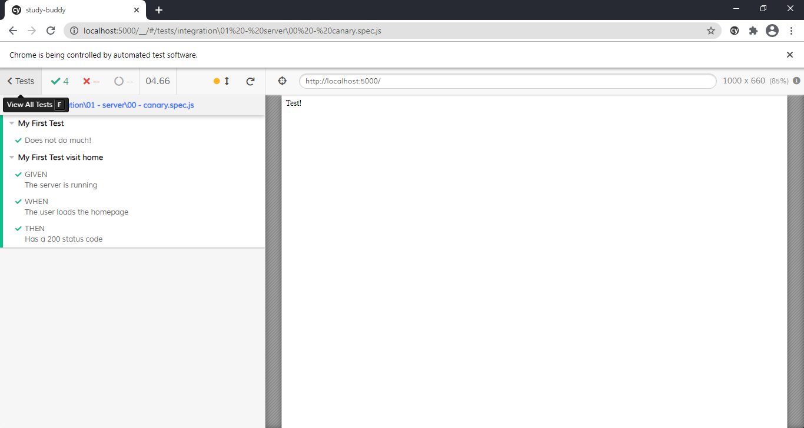

***
# Week 1 - Friday (26 02 2021)

## General progress
+ Archived old project
+ Created new Readme 
+ Import advanced node starter to use typescript + node
+ Client is currently to be based on WebComponents
## New Features

## New Bugs

## Tooling update
+ Imported the advanced node starter and using cypress + jest  
## Useful Resources
+ Markdown Cheat sheet - https://github.com/adam-p/markdown-here/wiki/Markdown-Cheatsheet