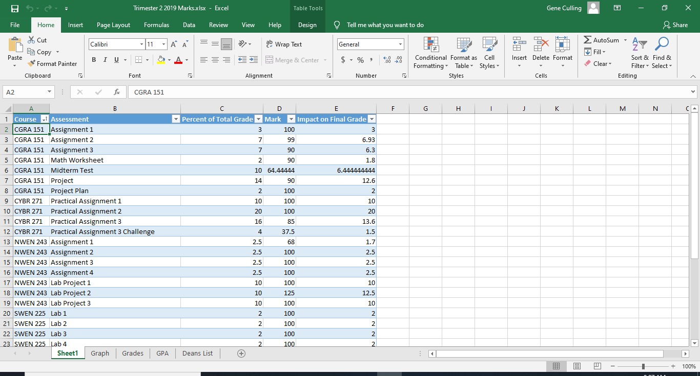
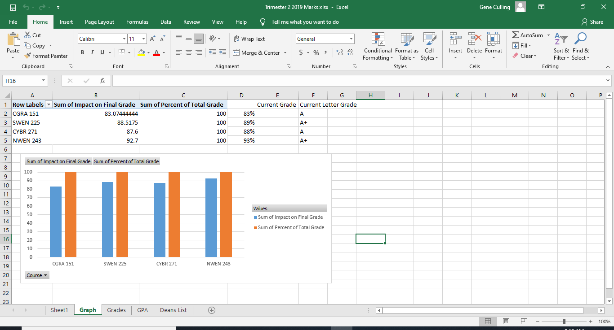
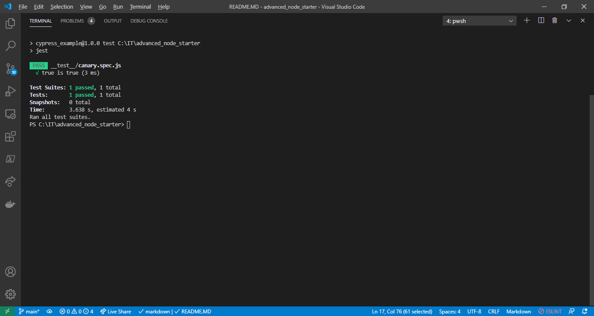
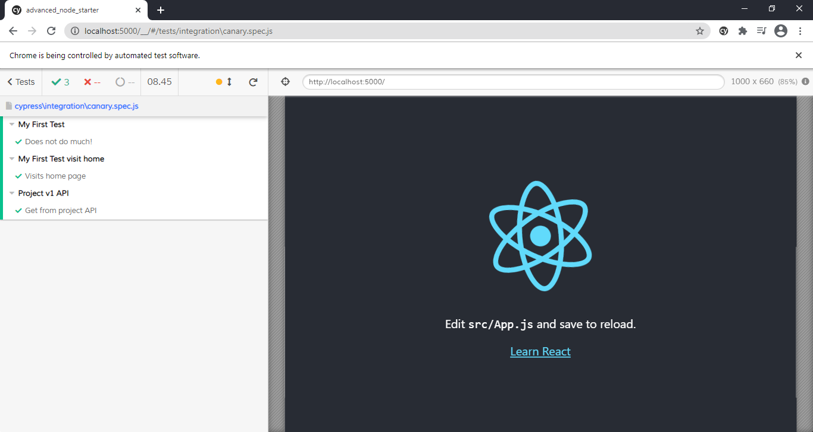

# Study Buddy

## Background




While I was studying at university I had a few tools that helped me to track my progress and help with studying. 
The first was a spreadsheet with the current courses, assessments, weightings and marks for those assessments. This also made graphs that helped to easily understand my current progress.

When studying I used a mix of pomodoro and interleaved learning for study and revision. The technique let me learn a lot and kept me engaged with the topics, and this lead to great results. Much like HIIT (High intensity interval training), the sessions are relatively short and are aiming for a high engagement.

## Vison
**App concept**: A website or app that can be used to show the results of their studies with their current grade, and tools to help people with their study.

**Key Features**: 
+ Current grades are shown for each subject in a way that makes understanding easy
+ Tools are included to help with study and revision

## Description


## Screenshots


# Instructions 
When the app is run, the site is available from http://localhost:5000

## Server - Node.js
+ Node.JS written in typescript

To run the server in dev mode. This will rebuild on each saved edit via nodemon.
To modify the nodemon files edit the nodemon.json file
``` 
npm run dev:be
```

To run the server standalone 
```
npm start
```

## Client - Html with web components
Client code for the front end is in the folder client_build.


## Unit tests


Unit tests are done by running 
```
npm test
```

## Integration tests
### Cypress


Tests are stored within ./cypress/integration

Full cypress documentation https://www.cypress.io/

### Running Cypress
```
npm run cypress
```
