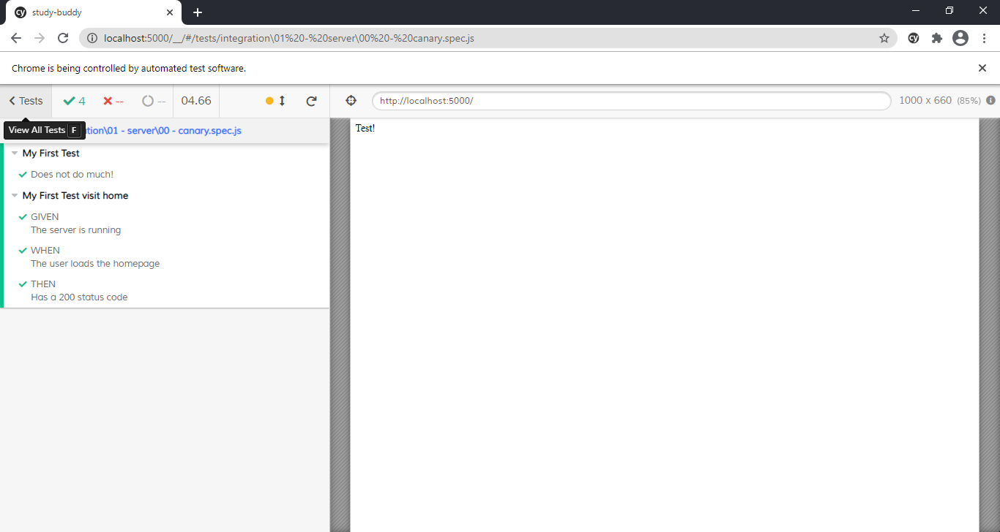

***
# End of project (25 05 2021)

## General progress
+ I will be restarting development from scratch using different technologies. After a two month break from working on the project, I came back and found it difficult to get started with even minimal improvements. Many of these issues came from complications with shadowDom and shadowRoot.

## Lessons Learnt
+ Applications made from web components are difficult to test and quickly build upon


***
# Week 5 - Friday (26 03 2021)

## General progress
+ The weekend was largely taken by making Ramen from scratch
+ Using the localstorage function to save and load new subjects
## New Features
+ load and save new subjects 
## New Bugs
+ no new bugs added
## Tooling update
+ Updated tests to include querying shadow doms

## Lessons Learnt
+ 

## Useful Resources
+ Ramen - https://glebekitchen.com/tonkotsu-ramen-home/

***
# Week 4 - Friday (19 03 2021)

## General progress
+ Started work on subject input card as a web component
+ Signed up for pluralsight for courses related to UX design
+ Created test for input of a new subject, and learnt a lot about cypress and the shadow dom
## New Features
+ No new features added
## New Bugs
+ Subjects page isn't functional 

## Tooling update
+ Updated tests to include querying shadow doms

## Lessons Learnt
+ Grid layout is useful, but divs are possibly better as a first attempt for layouts
+ Shadow dom is now supported - but difficult to deal with if not using the "includeShadowDom" flag in cypress.json
+ There are issues with using clear() followed by type(....) that can be avoided by using the combined long form of .type(`{selectall}{backspace}${...mytext variable here....}`, {force: true});
+ The type force:true option is sometimes needed, including when dealing with multiple inputs 


## Useful Resources
+ pluralsight.com - has a special rate for old "code school" subscribers. 
+ Force typing into inputs - https://github.com/cypress-io/cypress/issues/5830
+ What the clear command actually does - https://docs.cypress.io/api/commands/clear.html#Documentation
+ Options to get within the shadow dom - https://docs.cypress.io/api/commands/get.html#Arguments

***
# Week 3 - Friday (12 03 2021)

## General progress
+ Sick for most of the week
+ Started on the page that will accept subject data
+ With the idea that you can put off more difficult choices and implementations until later, local storage is to be used to avoid issues with authentication and get straight to a potential MVP

## New Features
+ Added a strategy for localStorage
## New Bugs
+ Subjects page isn't functional 

## Tooling update
+ Cypress now includes ways of dealing with local storage, allowing it to persist between tests.
+ Tests are now changed to a function that is called within the it block e.g.
```
 it("desc", ()=>{ when();})
```
This allows for the code to be a little more separated and could allow for the descriptions of the test to still work, while allowing for auto retry to cover all of the previous steps (given, when, then )


## Lessons Learnt
+ Cypress clears all localStorage between each test
+ If cypress and a nodejs server are using the same port then there can be messages of XSRF, using the --port option can allow a port to be manually specified.


## Useful Resources
+ Persisting local storage across tests - https://stackoverflow.com/questions/50471047/preserve-cookies-localstorage-session-across-tests-in-cypress 


***
# Week 2 - Friday (5 03 2021)

## General progress
+ Added Graph for dummy data
+ Improved styling for graph

## New Features
+ No new general features
## New Bugs
+ Graph isn't responsive and doesn't scale with the number of topics 

## Tooling update
+ No tooling updates

## Lessons Learnt
+ D3 visualisations are quite brittle and it requires a unique selector for all element types that will be drawn (e.g. the total bar vs the impact on total bar)

## Useful Resources
+ Free Code Camp - D3 for Data visualisations - https://www.freecodecamp.org/learn/data-visualization/data-visualization-with-d3
+ CSS Grid Guide - https://css-tricks.com/snippets/css/complete-guide-grid/
***
# Week 1 - Friday (26 02 2021)

## General progress
+ Archived old project
+ Created new Readme 
+ Import advanced node starter to use typescript + node
+ Client is currently to be based on WebComponents
## New Features

## New Bugs

## Tooling update
+ Imported the advanced node starter and using cypress + jest  

## Lessons Learnt

## Useful Resources
+ Markdown Cheat sheet - https://github.com/adam-p/markdown-here/wiki/Markdown-Cheatsheet